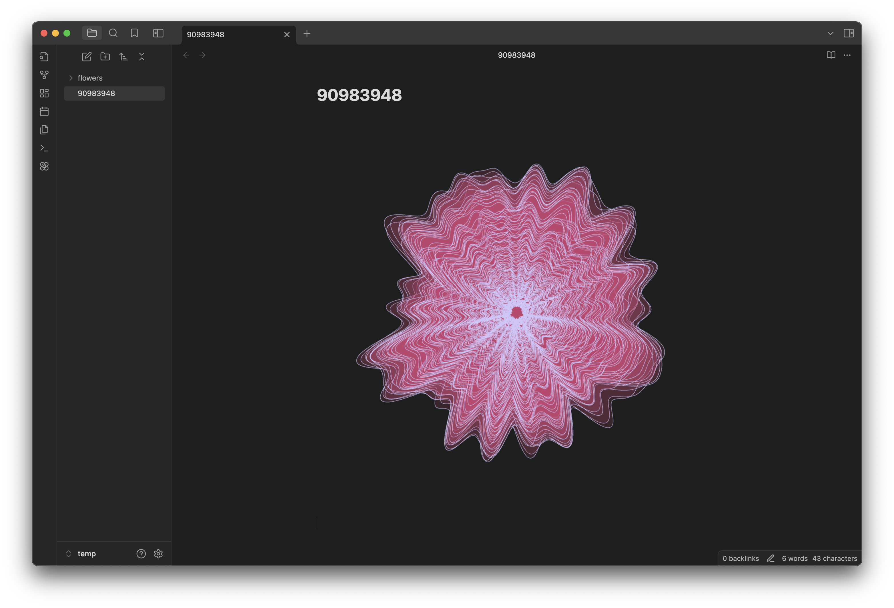
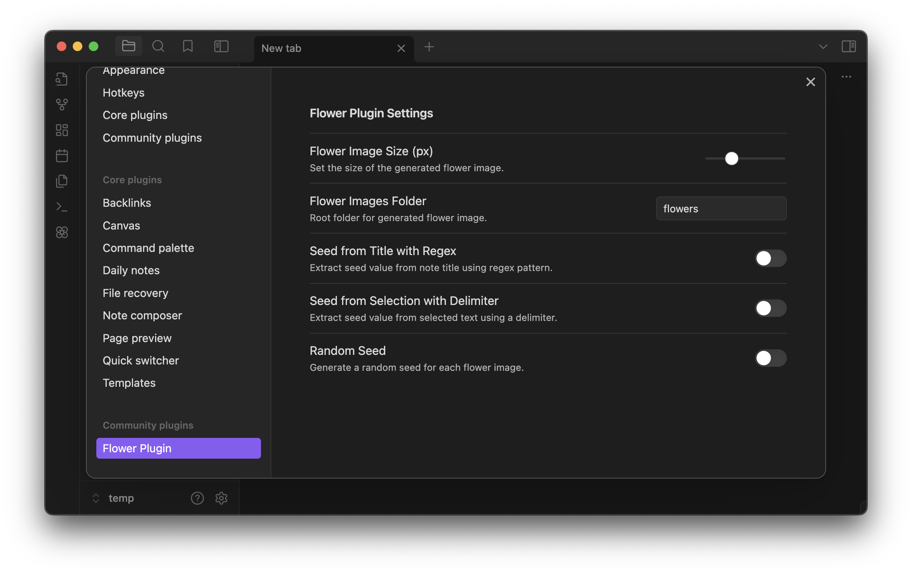
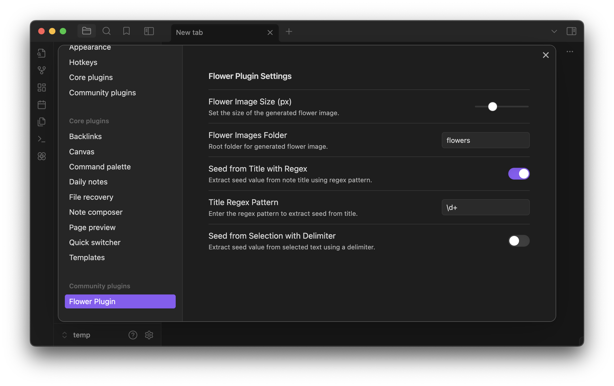
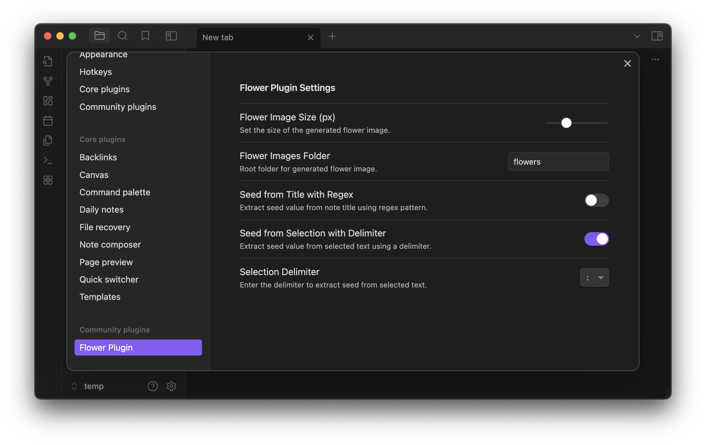

# 🌻 Obsidian Flower Plugin

This is a Obsidian Custom Plugin that generates random flowers based on the simplex noise. Idea and algorithm from [benfred repo](https://github.com/benfred/simplex-flowers).

## Getting Started

### 🗿 Users

1. Download [source code](https://github.com/skirt-owner/flower-plugin/archive/refs/heads/master.zip) or [main.js](./main.js), [styles.css](./styles.css), [manifest.json](./manifest.json).
2. Unarchive and copy over `main.js`, `styles.css`, `manifest.json` to your vault `VaultFolder/.obsidian/plugins/flower-plugin/`.
3. In Obsidian, open Settings.
4. In the side menu, select Community plugins.
5. Select Turn on community plugins.
6. Under Installed plugins, enable the Flower Plugin.

### 💻 Devs

1. Clone this repo.
2. Unarcive and put to your vault `VaultFolder/.obsidian/plugins/flower-plugin/`
> **_Note:_** Remeber not to test on your main vault!
3. Make sure you have NodeJS installed.
4. `npm i` to install dependencies.
5. `npm run dev` to start compilation in watch mode.

## ⚙️ Settings Preview

1. **`FLower Image Size (px)`** - It's the size of an image in range `[10; 1000]`
2. **`Flower Images Folder`** - Here you can specify folder where you want to store generated images in your vault.
> **_Note:_** For example `'flowers'` or `'assets/flowers'` - plugin will create all folders that don't exist.
3. **`Seed from Title with Regex`** - when toggled you'll see a text field where you can specify regex string to get seed from title of a Markdown Note:
> **_Note:_** On default the regex string will consider any first number in title as a seed.

4. **`Seed from Selection with Delimiter`** - when toggled plugin can recognize `<seed value:[1;15 digits]><delimiter><size value:[10;1000]>` selection in the note and generate a flower based on specified values (overrides settings values).
> **_Note:_** You can also use `<seed value><delimiter>` or `<delimiter><size value>` strings, and `size value` will be used based on settings and `seed value` will be taken from title (if **`Seed from Title with Regex`** is toggled) or random one othewise.

5. **`Random Seed`** - pretty straightforward but it will just use random seed value and size specified in settings.

> ❗❗❗ **(3) and (4) cannot be toggled when (5) is active and vice versa.**

## Contact

For any inquiries or questions, feel free to [contact me](mailto:skirtsfield@gmail.com) or reach out on [Telegram](https://t.me/skirtsfield).
